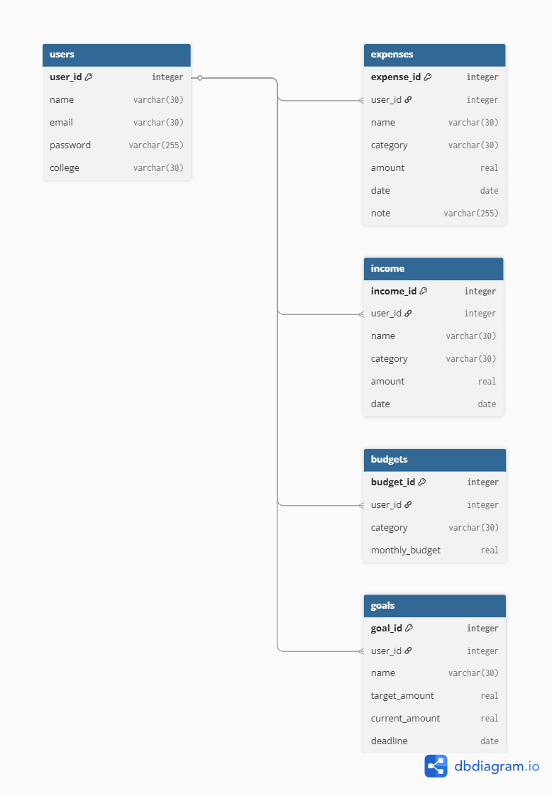

# Finly 💰

### AI-Powered Personal Finance Tracker for Students

Finly is a web-based personal finance management application built for college students. It helps track expenses, manage budgets, set savings goals, and monitor income — all in one clean dashboard.

> Built as a DBMS Minor Project | IET DAVV | 2025-26

---

## 👥 Team

| Name           | Role                      |
| -------------- | ------------------------- |
| Disha Lowanshi | Frontend & Design         |
| Mahak Bansal   | Backend (Python + Django) |
| Ansh Zamde     | Database (SQLite)         |

---

## 🚀 Features

- User authentication (login & register)
- Expense tracking with categories
- Monthly budget limits per category
- Income tracking
- Savings goals with progress tracking
- Budget vs actual spending view
- AI tips on spending patterns
- Analytics dashboard with charts

---

## 🛠️ Tech Stack

| Layer    | Technology            |
| -------- | --------------------- |
| Frontend | HTML, CSS, JavaScript |
| Backend  | Python, Django        |
| Database | SQLite ,SQL           |
| Charts   | Chart.js              |

---

## 🗄️ Database Design

5 tables — normalized to 3NF with foreign key constraints.

- `users` — stores registered users
- `expenses` — tracks all expense entries per user
- `income` — tracks income entries per user
- `budgets` — monthly budget limits per category per user
- `goals` — savings goals with target and current amount

### ER Diagram

()

### Key DB Features

- Foreign key constraints with referential integrity
- `monthly_summary` VIEW — joins budgets and expenses to show spent vs remaining per category
- Trigger — blocks expense insert if it exceeds monthly budget for that category
- Core queries for dashboard, analytics, and budget tracking

---

## 📁 Project Structure

```
Finly/
├── db/
│   ├── schema.sql        # CREATE TABLE statements
│   ├── seed.sql          # Sample data
│   ├── queries.sql       # Core SQL queries
│   ├── view.sql          # monthly_summary VIEW
│   ├── trigger.sql       # Budget check trigger
│   └── er-diagram.png    # ER diagram
├── html/                 # All frontend pages
├── css/                  # Shared styles
├── js/                   # JavaScript files
└── README.md
```

---

## ⚙️ Setup Instructions

**1. Clone the repo**

```
git clone https://github.com/mahak0505/Finly.git
cd Finly
```

**2. Set up the database**

```
cd db
sqlite3 finly.db < schema.sql
sqlite3 finly.db < seed.sql
```

**3. Install backend dependencies**

```
pip install flask
```

**4. Run the app**

```
python app.py
```

**5. Open in browser**

```
http://localhost:5000
```

---

## 📸 Screenshots

_Coming soon_

---

## 📄 License

This project is for educational purposes only.
